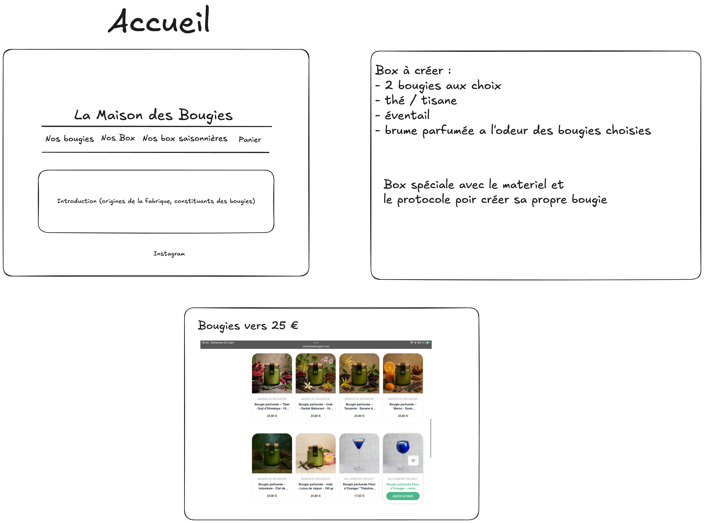

## PROJET NSI - Cléa et Alana

#### Description du site web

Le numérique est désormais partout. Dans notre vie professionnelle comme privée. La vente en ligne s'est rapidement formée. Donc voilà un site de vente de bougies en ligne, accessible à tous.

#### Maquette des pages web

---

#### Annexes

* Exemples de sites marchands
    * [Les Bougies de Charroux](https://www.bougies-charroux.com)
    * [Les Bougies de France](https://www.lesbougiesdefrance.fr)
* Exemples de faux sites web
    * [By Daddy](https://chrc.github.io)
    * [Ceramic](https://demo.templatesjungle.com/clayhaven) 
* Exemples de photos avec des bougies
    * [Photos de bougies - pexels](https://www.pexels.com/fr-fr/chercher/bougies)
    * [Photos de bougies - unsplash](https://unsplash.com/fr/s/photos/bougies) 

